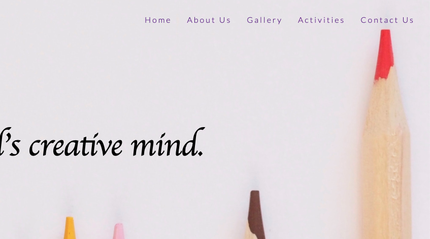
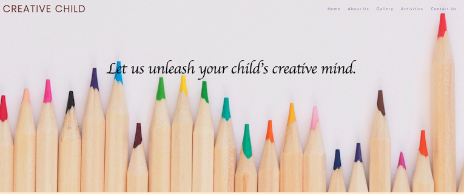
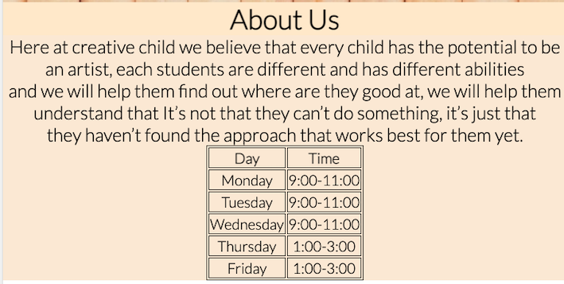
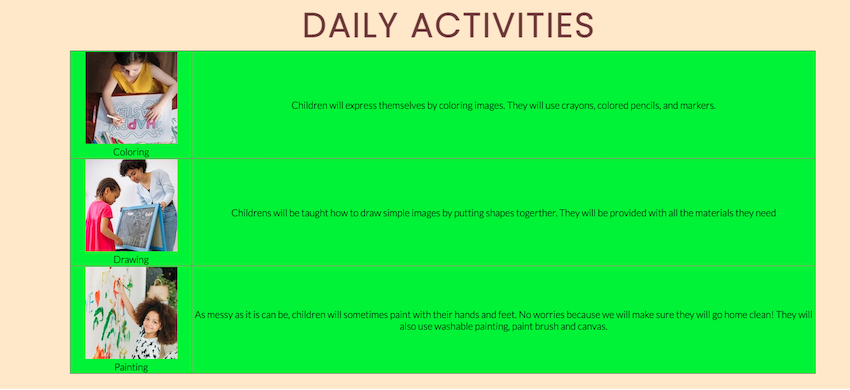
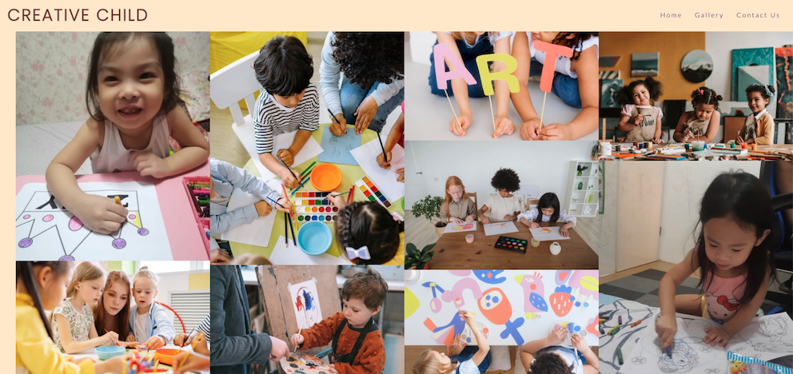

<h1>CREATIVE CHILD</h1>

Creative child is a website focusing on kids who loves to do art, 
we also specialize on kids who likes art but thinks they are not good at it.
We will help them find the approach that will best work for them.

<h2>Technologies Used</h2>
<h3>Languages Used</h3>
<ul>
<li>HTML</li>
<li>CSS</li>
</ul>

<h3>Frameworks, Libraries & Program Used</h3>
<ul>
<li> [Google Fonts](https://fonts.google.com/) - Used to import fonts to style.css file whice used on the pages of the website.</li>
<li>Hover.css- Was used on the social media icons in the footer to add changing color while being hovered over by the user.</li>
<li>Git-Was used for version control by utilizing the Gitpod terminal to commit to git and push to Github.</li>
<li>[Github](https://github.com/)-Was used to store projects.</li>
<li>[Pecxels](https://www.pexels.com/)- Was used to import photos that was used for the project.</li>
</ul>
<h2>FEATURES</h2>
Navigation BAR
<ul>
<li>
both the gallery and the home page contains navigation bar for easy navigation, it contains Home, About Us, Gallery, Activities and Contacts section.
This section will allow the user to easily navigate from page to page across all devices without having to revert back to the previous page via the ‘back’ button.
</li>
</ul>

<h2>The Landing Page image</h2>
<ul>
<li>The landing page image contains colored pencils picture with a phrase "Lets unleash your child's creative mind."
for me it’s a very strong catch phrase it grabs the attention of the parents who like to enroll their kids to the art class.</li>
</ul>

<h2>About us</h2>
<ul>
<li>This section contains out mission and vision for the kids, we believe all kids have artistic mind they just need to have their own approach and perspective.
it also contains our weekly schedule time and day. It also has a picture of kid happily doing art to excite the parents to enroll their child.
</li>
</ul>

<h2>Daily Activities</h2>
<ul>
<li>This section provides The parents with information about the different art classes that we offer,
they may choose from drawing class, painting class and coloring class based on the age and the likes of their kids.</li>
</ul>

<h2>Footer</h2>
This section contains our social media handles where the parents can see the classrooms environment and the activities of the  kids through our social media accounts.

<h2>Gallery</h2>
<ul>
<li>The gallery section will provide the parents images on how the kids do their daily activities.
This section is important because it shows the children working on their artwork the parents 
also can see the class room environment where their children are at.
</li>
</ul>    

<h2>Features left to implement</h2>
<ul>
<li>In the future we will add a Sign up section, where the parents can easily sign up their child through the webpage
just by summiting their name and email address.</li>
</ul>

<h2>Testing</h2>(waitig for metor for i dont understand the tested file on where to fix bugs)

<h2>Deployment</h2>
<ul>
<li>This site was deployed to github
In the GitHub repository, navigate to the Settings tab
From the source section drop-down menu, select the Master Branch
Once the master branch has been selected, the page will be automatically refreshed with a detailed ribbon display to indicate the successful deployment.
</li>
</ul>

<h2>Credits</h2>
<h3>Content</h3>
<ul>
<li>The design of the hero image was inspired by the love running project hero image which is 100% of the top page.</li>
<li>The footer was inspired by the YouTube page named "code opacity".
Icons from the footer section was taken from font awesome</li>
</ul>

<h3>Media</h3>
<ul>
<li>All the photos on this website (gallery section included) was downloaded from pecxels except for one photo in the about section which I took myself.</li>
</ul>

<h3>Acknowledgements</h3>
<ul>
<li>My mentor for the very good planning, suggestions and feedback</li>
<li>Tutor support</li>
</ul>

